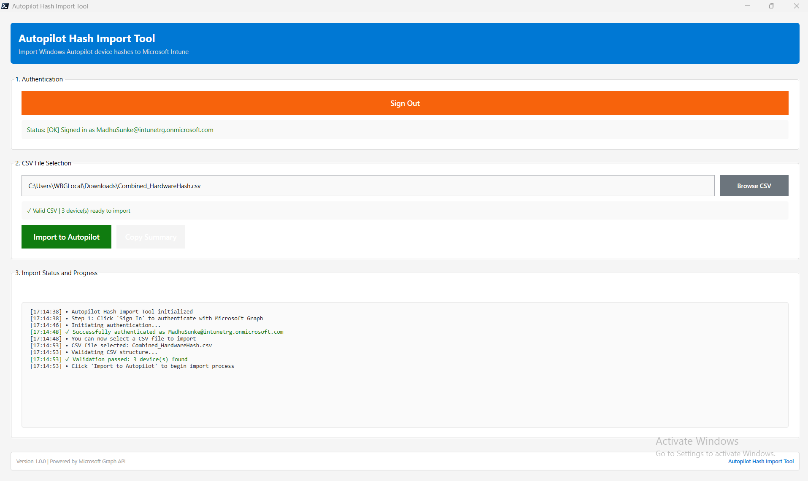

# Autopilot Hash Import Tool


A PowerShell WPF GUI application for importing Windows Autopilot device hashes into Microsoft Intune.

## Features

✅ **Interactive Authentication** - Delegated user authentication via Microsoft Graph  
✅ **CSV Validation** - Automatic validation of device hash CSV files  
✅ **Real-time Progress** - Live status updates during import  
✅ **Error Handling** - Detailed error reporting for failed imports  
✅ **No Secrets Required** - Uses user credentials, no client secrets needed

## Prerequisites

- Windows 10/11 or Windows Server
- PowerShell 5.1 or later (PowerShell 7+ / pwsh is supported but the GUI requires Windows PowerShell / WPF)
- Internet connectivity
- Azure AD App Registration (see setup below)
- Intune Administrator or equivalent role

## Setup

### 1. Register Azure AD Application

1. Navigate to [Azure Portal](https://portal.azure.com)
2. Go to **Entra ID** > **App registrations** > **New registration**
3. Configure:
   - **Name**: Autopilot Hash Import Tool
   - **Supported account types**: Single tenant
   - **Redirect URI**: Public client - `http://localhost`
4. Note the **Application (client) ID** and **Directory (tenant) ID**

### 2. Configure API Permissions

1. Go to **API permissions** > **Add a permission**
2. Select **Microsoft Graph** > **Delegated permissions**
3. Add:
   - `DeviceManagementServiceConfig.ReadWrite.All`
   - `User.Read`
4. Click **Grant admin consent**

### 3. Enable Public Client Flow

1. Go to **Authentication**
2. Under **Advanced settings**, set **Allow public client flows** to **Yes**
3. Click **Save**

### 4. Update Configuration

1. Copy `Config\AppConfig.json.template` to `Config\AppConfig.json`
2. Edit `Config\AppConfig.json` with your values:

```json
{
    "ClientId": "YOUR_APPLICATION_CLIENT_ID",
    "TenantId": "YOUR_TENANT_ID",
    "GraphApiVersion": "beta"
}
```

## Usage

### Running the Tool

You can run the tool from Windows PowerShell (5.1+) or PowerShell 7+ (`pwsh`). The WPF GUI requires Windows and the script uses WPF APIs which are available in Windows PowerShell; running under PowerShell 7+ will still work on Windows but use `pwsh.exe` explicitly.

Quick steps (PowerShell 5.1 / Windows PowerShell):

1. Extract the tool folder
2. Right-click `AutopilotHashImportTool.ps1` and choose **Run with PowerShell**

Quick steps (PowerShell 7+ / pwsh):

1. Open a PowerShell terminal (Run as Administrator if required by your execution policy)
2. Change to the tool folder, for example:

```powershell
Set-Location -Path 'D:\Proj\AutopilotHashImportTool'
```

3. Run the script with:

```powershell
pwsh -File .\AutopilotHashImportTool.ps1
```

Note: If execution is blocked by policy, you can temporarily allow scripts for the current process with:

```powershell
pwsh -NoProfile -ExecutionPolicy Bypass -File .\AutopilotHashImportTool.ps1
```

Or in Windows PowerShell (5.1):

```powershell
powershell -ExecutionPolicy Bypass -File .\AutopilotHashImportTool.ps1
```

### Import Process

1. **Authenticate**: Click "Sign In" and enter your credentials
2. **Select CSV**: Click "Browse" and select your Autopilot hash CSV file
3. **Import**: Click "Import to Autopilot" to begin the import

### CSV Format

Your CSV must contain these columns (header names are case-insensitive and small variations are accepted by the validator):
- `Device Serial Number` (or `SerialNumber`, `Device Serial`, etc.)
- `Hardware Hash` (or `HardwareHash`, `Hash`, etc.)

Example:
```csv
Device Serial Number,Hardware Hash
ABC123,AAAAB3NzaC1yc2EAAAADAQABAAAB...
DEF456,AAAAB3NzaC1yc2EAAAADAQABAAAC...
```

## Troubleshooting

### Authentication Fails
- Verify app registration details in `Config\AppConfig.json`
- Ensure you have appropriate Intune permissions
- Check that admin consent has been granted

### CSV Validation Fails
- Verify column headers match required format (see CSV Format above)
- Ensure the Hardware Hash column contains Base64-encoded values
- Check for empty or malformed rows

### Import Fails
- Check network connectivity
- Verify you're still authenticated
- Review the status log in the GUI for specific error details

## Distribution

To distribute this tool to other IT admins:

1. Zip the entire folder
2. Share via email, SharePoint, or file share
3. Recipients only need to:
   - Extract the folder
   - Run the PowerShell script
   - Sign in with their credentials

No additional configuration needed! Access is controlled by:
- Azure AD app access
- User's Intune role assignments
- Conditional Access policies

## Security

- ✅ No client secrets stored
- ✅ Users authenticate with their own credentials
- ✅ MFA and Conditional Access enforced
- ✅ All actions logged with user identity
- ✅ Access controlled by Azure AD roles

### Disclaimer

This tool is provided 'as‑is' without warranty. Use it at your own risk. Test in a non‑production environment before use. The author is not responsible for data loss, system outages, or other damages arising from use of this tool. For production use, obtain approval from your IT/security team.

## Support

For issues or questions:
- Review the status log for detailed error information
- Check Azure AD sign-in logs
- Verify Graph API permissions

## Version History

- **1.0.0** - Initial release
  - Interactive authentication
  - CSV validation
  - Batch import with progress tracking

## License

This tool is provided as-is for use within your organization.
